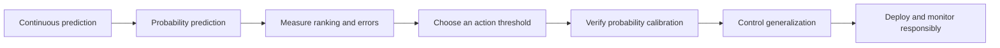

# Week 1 Book: Regression to Production Classification

This folder is the book-style entry point for the seven chapters.

## Downloadable guide

- [Week 1 quick-start DOCX](Week_01_ML_Foundations_Study_Guide.docx)
- [Complete seven-chapter Markdown book](Week_1_ML_Foundations_Study_Guide.md)

## Reading order

1. [Linear regression](../chapters/01_linear_regression/README.md)
2. [Logistic regression](../chapters/02_logistic_regression/README.md)
3. [Classification metrics](../chapters/03_classification_metrics/README.md)
4. [Thresholds and calibration](../chapters/04_thresholds_and_calibration/README.md)
5. [Bias, variance, and regularization](../chapters/05_bias_variance_regularization/README.md)
6. [Incident-priority capstone](../chapters/06_incident_priority_capstone/README.md)
7. [Quiz and presentation](../chapters/07_quiz_and_presentation/README.md)

## The conceptual arc

The chapters intentionally use a recurring incident-management example. This allows every mathematical concept to connect to the same operational decision: which incidents should receive urgent human attention?
