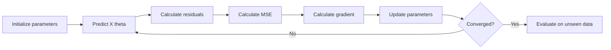
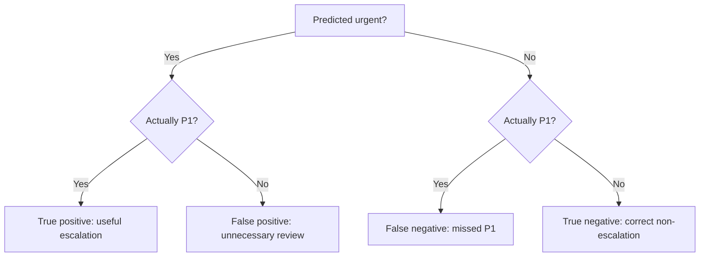
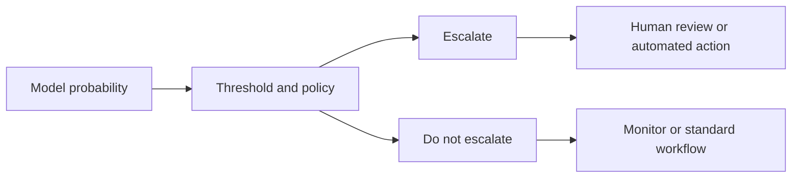
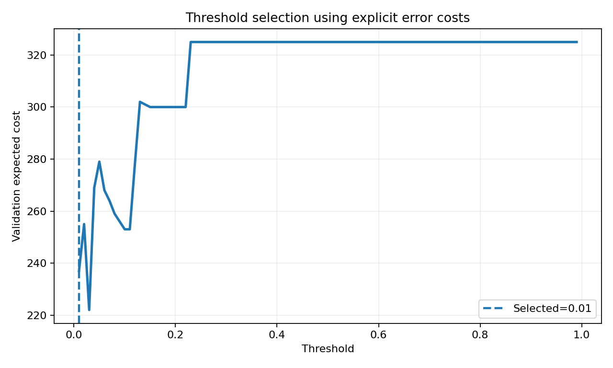
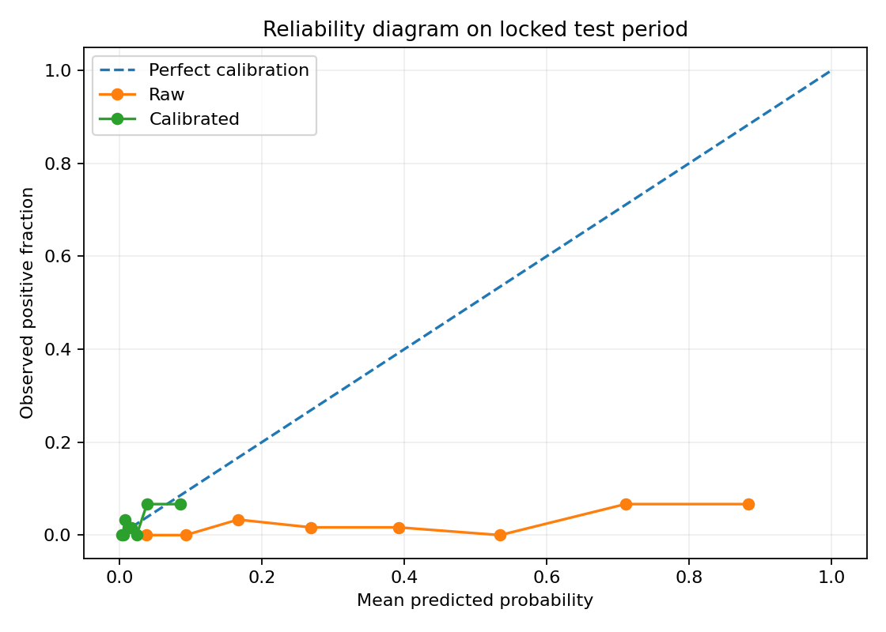
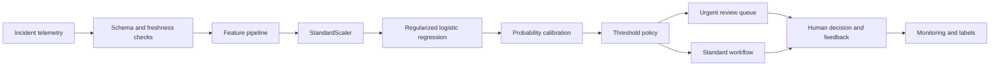

# Week 1 ML Foundations Study Guide

This book combines the seven repository chapters into one GitHub-readable document. Use the individual chapter folders for executed notebooks, source code, exercises, and interview material.

## Table of contents

1. Linear Regression, MSE, and Gradient Descent
2. Logistic Regression, Sigmoid, and Cross-Entropy
3. Classification Metrics
4. Threshold Selection and Calibration
5. Bias, Variance, and Regularization
6. Incident-Priority Classifier Capstone
7. Mastery Quiz and Five-Minute Presentation


---

# Chapter 01 - Linear Regression, MSE, and Gradient Descent

## Learning objective

Build a linear regression model from first principles and explain how a loss function and an optimizer turn data into model parameters.

By the end of this chapter you should be able to:

- Explain slope, intercept, prediction, residual, and loss.
- Calculate MSE, RMSE, MAE, and R-squared.
- Derive the gradients of MSE.
- Implement vectorized batch gradient descent with NumPy.
- Diagnose slow convergence, divergence, and feature-scaling problems.
- Compare gradient descent with the pseudoinverse or ordinary least squares.
- Discuss when a linear baseline is preferable to a more complex model.

## Files

- [Book-style DOCX](../chapters/01_linear_regression/chapter_01_linear_regression_book.docx)
- [Executed NumPy notebook](../chapters/01_linear_regression/01_linear_regression_numpy.ipynb)
- [Standalone implementation](../chapters/01_linear_regression/linear_regression_numpy_from_scratch.py)
- [Interview questions](../chapters/01_linear_regression/interview_qa.md)
- [Exercises](../chapters/01_linear_regression/exercises.md)

## 1. Problem formulation

For one feature, simple linear regression predicts:

$$
\hat{y}_i = w x_i + b
$$

where:

- $x_i$ is the feature for observation $i$.
- $w$ is the slope or feature coefficient.
- $b$ is the intercept.
- $\hat{y}_i$ is the predicted target.
- $y_i$ is the observed target.

A residual using the convention in this repository is:

$$
e_i = \hat{y}_i - y_i
$$

The sign convention is not universal. Always state it before interpreting residual direction.


## 2. Mean Squared Error

$$
J(w,b) = \frac{1}{n}\sum_{i=1}^{n}(\hat{y}_i-y_i)^2
$$

MSE is differentiable and penalizes large errors strongly. That is useful for optimization, but it also makes the metric sensitive to outliers. RMSE restores the original target unit:

$$
RMSE = \sqrt{MSE}
$$

MAE provides a more robust comparison because it uses absolute error.

## 3. Gradient derivation

Substitute $\hat{y}_i = wx_i+b$ into MSE:

$$
J(w,b) = \frac{1}{n}\sum_{i=1}^{n}(wx_i+b-y_i)^2
$$

The gradients are:

$$
\frac{\partial J}{\partial w}
= \frac{2}{n}\sum_{i=1}^{n}(\hat{y}_i-y_i)x_i
$$

$$
\frac{\partial J}{\partial b}
= \frac{2}{n}\sum_{i=1}^{n}(\hat{y}_i-y_i)
$$

The update rule is:

$$
w \leftarrow w - \alpha\frac{\partial J}{\partial w}
$$

$$
b \leftarrow b - \alpha\frac{\partial J}{\partial b}
$$

where $\alpha$ is the learning rate.

## 4. Vectorized form

For multiple features, include an intercept column in the design matrix $X$ and combine all parameters in $\theta$:

$$
\hat{y} = X\theta
$$

$$
\nabla_{\theta}J = \frac{2}{n}X^T(X\theta-y)
$$

```python
prediction = X @ theta
error = prediction - y
gradient = (2.0 / len(y)) * (X.T @ error)
theta = theta - learning_rate * gradient
```

## 5. Optimization flow




## 6. Learning-rate diagnosis

| Behavior | Likely cause | Action |
|---|---|---|
| Loss decreases very slowly | Learning rate too small or features poorly scaled | Increase carefully; standardize features |
| Loss oscillates | Learning rate too large | Reduce the learning rate |
| Loss becomes NaN or infinity | Divergence, overflow, or invalid data | Check scaling, step size, and finite values |
| Training loss falls but validation loss rises | Overfitting or distribution mismatch | Regularize, simplify, collect data, inspect split |
| Coefficients have extreme magnitudes | Collinearity, scaling, or leakage | Inspect correlations and data generation |


## 7. Closed-form solution versus gradient descent

The pseudoinverse solution is:

$$
\theta = X^{+}y
$$

Use a stable linear-algebra routine such as `np.linalg.pinv` or `np.linalg.lstsq` rather than explicitly calculating $(X^TX)^{-1}$.

| Dimension | Closed form | Gradient descent |
|---|---|---|
| Setup | Minimal | Requires learning rate and stopping policy |
| Scale | Good for modest dense problems | Better fit for large or streaming workflows |
| Debugging | Useful reference answer | Requires convergence monitoring |
| Extension | Specific to compatible objectives | General optimization pattern used across ML |


## 8. Production and leadership perspective

A Director-level answer should not end at model accuracy. Ask:

- What decision will the prediction change?
- What is the cost of underprediction and overprediction?
- Is a linear relationship plausible across all segments?
- Are features available at prediction time?
- Does the simple model improve user action compared with a rule or average?
- How will drift, residuals, latency, and adoption be monitored?
- Would a 3 percent RMSE improvement justify a harder-to-operate model?

## Mastery check

You are ready for Chapter 02 when you can derive the gradients, write the NumPy loop without notes, and explain why regression output is not automatically a probability.


---

# Chapter 02 - Logistic Regression, Sigmoid, and Cross-Entropy

## Learning objective

Convert a linear score into a probability for a binary event, train the model with cross-entropy, and compare a NumPy implementation with scikit-learn.

By the end of this chapter you should be able to:

- Explain probability, odds, log-odds, logits, and the sigmoid function.
- Derive the binary cross-entropy loss and its gradient.
- Implement numerically stable logistic regression with NumPy.
- Interpret coefficients and odds ratios carefully.
- Compare from-scratch results with scikit-learn.
- Explain why the default threshold of 0.5 is not a business rule.

## Files

- [Executed notebook](../chapters/02_logistic_regression/02_logistic_regression_numpy_vs_sklearn.ipynb)
- [Standalone NumPy example](../chapters/02_logistic_regression/logistic_regression_numpy.py)
- [Interview questions](../chapters/02_logistic_regression/interview_qa.md)
- [Exercises](../chapters/02_logistic_regression/exercises.md)

## 1. From a linear score to a probability

A linear model produces a score:

$$
z_i = w^T x_i + b
$$

The score can be any real number. The sigmoid maps it to $(0,1)$:

$$
\sigma(z)=\frac{1}{1+e^{-z}}
$$

The model probability is:

$$
P(y_i=1\mid x_i)=\sigma(w^Tx_i+b)
$$

The inverse relationship is the logit:

$$
\log\left(\frac{p}{1-p}\right)=w^Tx+b
$$

This means the model is linear in log-odds, not in probability.


## 2. Why cross-entropy instead of MSE?

For binary labels $y_i\in\{0,1\}$, binary cross-entropy is:

$$
J(w,b)=-\frac{1}{n}\sum_{i=1}^{n}
\left[y_i\log(p_i)+(1-y_i)\log(1-p_i)\right]
$$

The loss heavily penalizes confident wrong predictions. It is the negative log-likelihood of a Bernoulli model and produces a convenient gradient.

For the combined parameter vector $\theta$ and design matrix $X$:

$$
p=\sigma(X\theta)
$$

$$
\nabla_{\theta}J=\frac{1}{n}X^T(p-y)
$$

The update is:

$$
\theta\leftarrow\theta-\alpha\nabla_{\theta}J
$$

## 3. Numerically stable sigmoid and loss

Directly evaluating `exp(-z)` can overflow for a large negative score. A stable implementation uses separate expressions for positive and negative values.

```python
import numpy as np


def stable_sigmoid(z):
    z = np.asarray(z, dtype=float)
    out = np.empty_like(z)
    positive = z >= 0
    out[positive] = 1.0 / (1.0 + np.exp(-z[positive]))
    exp_z = np.exp(z[~positive])
    out[~positive] = exp_z / (1.0 + exp_z)
    return out
```

For cross-entropy, clip probabilities away from exactly 0 and 1 before taking logarithms.

## 4. Training workflow


## 5. Vectorized NumPy core

```python
score = X @ theta
probability = stable_sigmoid(score)
gradient = (X.T @ (probability - y)) / len(y)
theta = theta - learning_rate * gradient
```

The intercept should normally not be regularized.

## 6. Coefficient interpretation

For feature $x_j$, a one-unit increase changes log-odds by $w_j$, holding other features constant. The odds multiplier is:

$$
\exp(w_j)
$$

Important cautions:

- A coefficient is not a causal effect without an appropriate design.
- The meaning of one unit depends on scaling.
- Correlated variables can destabilize coefficients.
- Interactions can make a single global coefficient misleading.
- The odds ratio is not the same as a probability difference.

## 7. Comparing with scikit-learn

A correct comparison must align:

- Feature scaling.
- Intercept handling.
- Regularization strength.
- Optimization tolerance.
- Train/test split.
- Label encoding.

scikit-learn logistic regression applies regularization by default. A from-scratch unregularized implementation will not necessarily match coefficients unless the configurations are made comparable.

```python
from sklearn.linear_model import LogisticRegression
from sklearn.pipeline import make_pipeline
from sklearn.preprocessing import StandardScaler

model = make_pipeline(
    StandardScaler(),
    LogisticRegression(max_iter=2000, C=1.0),
)
model.fit(X_train, y_train)
probability = model.predict_proba(X_test)[:, 1]
```

## 8. Decision boundary and threshold

The model estimates a probability. A downstream policy converts the probability into an action:

$$
\hat{y}=1 \quad \text{if} \quad p\ge t
$$

A threshold of 0.5 is only a default. For incident prioritization, missing a true P1 incident may be far more expensive than reviewing an extra alert. Threshold selection belongs in Chapter 04.


## 9. Common implementation mistakes

| Mistake | Consequence | Fix |
|---|---|---|
| Applying `log` to 0 or 1 | Infinite loss | Clip probabilities or use stable log-loss functions |
| Using labels such as 1 and 2 | Incorrect loss assumptions | Map to 0 and 1 |
| Regularizing the intercept | Unwanted bias shift | Exclude intercept from penalty |
| No feature scaling | Slow or unstable convergence | Standardize using training statistics |
| Comparing to scikit-learn without matching regularization | Coefficients differ | Align `C`, solver, scaling, and tolerance |
| Treating 0.5 as optimal | Business cost ignored | Tune threshold on validation data |

## 10. Leadership perspective

A Director-level review should ask:

- Does the system need a ranking, a probability, or an automated decision?
- How reliable are labels, especially for disputed incident priorities?
- Are model probabilities calibrated well enough for staffing or escalation decisions?
- Which segments have different base rates?
- Are features generated before or after manual triage?
- How should human overrides be captured and audited?
- What simple baseline must the model outperform?

## Mastery check

Move to Chapter 03 when you can derive $X^T(p-y)/n$, implement the optimizer without notes, and explain why good log-loss does not automatically imply good operational decisions.


---

# Chapter 03 - Precision, Recall, F1, ROC-AUC, and PR-AUC

## Learning objective

Choose evaluation metrics that reflect the operational cost of incident-priority decisions, especially when P1 incidents are rare.

By the end of this chapter you should be able to:

- Build and interpret a confusion matrix.
- Calculate precision, recall, specificity, accuracy, and F1.
- Explain threshold-dependent versus threshold-independent metrics.
- Interpret ROC and precision-recall curves.
- Explain why class imbalance changes metric usefulness.
- Select a primary metric and a guardrail metric for incident prediction.

## Files

- [Executed notebook](../chapters/03_classification_metrics/03_classification_metrics.ipynb)
- [Interview questions](../chapters/03_classification_metrics/interview_qa.md)
- [Exercises](../chapters/03_classification_metrics/exercises.md)

## 1. Start with the decision

Assume the positive class means `is_p1 = 1`.

| Outcome | Operational interpretation |
|---|---|
| True positive | A P1 incident is escalated |
| False positive | A non-P1 incident is escalated unnecessarily |
| False negative | A P1 incident is not escalated by the model |
| True negative | A non-P1 incident is not escalated |

The confusion matrix is not merely a reporting format. It is a map from model decisions to real consequences.



## 2. Core metrics

### Accuracy

$$
Accuracy=\frac{TP+TN}{TP+TN+FP+FN}
$$

Accuracy can be misleading when the positive class is rare. A model that predicts every incident as non-P1 may appear accurate while providing no useful detection.

### Precision

$$
Precision=\frac{TP}{TP+FP}
$$

Of the incidents escalated by the model, how many were truly P1?

### Recall or sensitivity

$$
Recall=\frac{TP}{TP+FN}
$$

Of all true P1 incidents, how many did the model escalate?

### Specificity

$$
Specificity=\frac{TN}{TN+FP}
$$

Of all non-P1 incidents, how many did the model avoid escalating?

### F1 score

$$
F1=2\cdot\frac{Precision\cdot Recall}{Precision+Recall}
$$

F1 is the harmonic mean of precision and recall. It treats them symmetrically and ignores true negatives. That may or may not reflect business cost.

### F-beta

$$
F_{\beta}=(1+\beta^2)\frac{Precision\cdot Recall}{\beta^2 Precision+Recall}
$$

Use $\beta>1$ when recall deserves more weight, but explain why the chosen weight reflects a decision rather than convenience.

## 3. A worked incident example

Suppose 1,000 incidents contain 20 true P1 cases. At one threshold:

- TP = 16
- FN = 4
- FP = 64
- TN = 916

Then:

- Accuracy = 93.2 percent
- Precision = 20.0 percent
- Recall = 80.0 percent
- Specificity = 93.5 percent
- F1 = 32.0 percent

The low precision does not automatically make the model unusable. If a missed P1 is extremely costly and review capacity can absorb 80 escalations, the policy may still be valuable. The reverse can also be true.

## 4. ROC curve and ROC-AUC

The ROC curve plots:

- True positive rate, which is recall.
- False positive rate, which is $FP/(FP+TN)$.

Each point represents a different threshold. ROC-AUC can be interpreted as ranking ability: the probability that a randomly selected positive receives a higher score than a randomly selected negative, subject to standard assumptions about ties.


### ROC-AUC strengths

- Summarizes ranking across thresholds.
- Useful for comparing discrimination.
- Not tied to one class prevalence in the same direct way as precision.

### ROC-AUC limitations

- Can look strong when the negative class is very large, even if the number of false positives is operationally unacceptable.
- Does not select a threshold.
- Does not measure calibration.
- A global value can hide poor performance in important segments.

## 5. Precision-recall curve and PR-AUC

The precision-recall curve plots precision against recall as the threshold changes. It focuses on positive-class retrieval and is often more informative when positives are rare.


This repository reports average precision, a standard summary related to the area under the precision-recall curve. Always name the exact implementation because different interpolation conventions can produce slightly different values.

### PR-AUC strengths

- Focuses on performance for the positive class.
- Exposes the precision cost of increasing recall.
- The baseline is linked to positive prevalence.

### PR-AUC limitations

- Changes when class prevalence changes.
- Does not choose the operating point.
- Does not directly encode monetary or safety cost.
- Can still hide segment failures.

## 6. Metric selection for incident prediction

A reasonable scorecard for rare P1 incidents is:

| Role | Metric | Why |
|---|---|---|
| Primary discrimination | Average precision or PR-AUC | Focuses on rare positive retrieval |
| Safety guardrail | Recall at the operating threshold | Controls missed P1 incidents |
| Capacity guardrail | Precision or alerts per day | Controls review burden |
| Ranking comparison | ROC-AUC | Gives a broad discrimination view |
| Probability quality | Brier score and reliability plot | Needed if probabilities drive staffing or risk |
| Business decision | Expected cost or utility | Connects errors to operational consequences |
| Reliability | Latency, availability, data freshness | A good model that is unavailable has no value |

## 7. Threshold-dependent and threshold-independent metrics

| Category | Examples | Use |
|---|---|---|
| Threshold-dependent | Precision, recall, F1, specificity, confusion matrix | Evaluate a chosen policy |
| Ranking | ROC-AUC, average precision | Compare score ordering across thresholds |
| Probability | Log-loss, Brier score, calibration error | Evaluate probability estimates |
| Business | Expected cost, time saved, missed-impact cost | Evaluate decision value |

A strong evaluation report includes all four categories rather than searching for one universal metric.

## 8. Segment analysis

Always evaluate at least:

- Service criticality.
- Geography or business unit when appropriate and lawful.
- New versus recurring incidents.
- Time period.
- Monitoring-confidence bands.
- Incident source or product family.

The overall average can hide a severe failure for a small but high-impact group.

## 9. Data and label quality

Metric interpretation depends on trustworthy labels. Investigate:

- Was priority assigned consistently?
- Did policy definitions change over time?
- Was the label influenced by the same automation being evaluated?
- Are incidents with missing telemetry excluded systematically?
- Does delayed relabeling create stale ground truth?

## 10. Leadership perspective

A Director should require a metric contract before approving deployment:

1. Define the positive class precisely.
2. State the cost and capacity assumptions.
3. Choose primary and guardrail metrics.
4. Define evaluation segments.
5. Define minimum acceptable performance and confidence intervals.
6. Define who may change the threshold.
7. Define monitoring and rollback criteria.

## Mastery check

Move to Chapter 04 when you can calculate the metrics from raw counts and defend why an incident model might prioritize recall while still controlling precision and alert volume.


---

# Chapter 04 - Threshold Selection and Probability Calibration

## Learning objective

Turn model probabilities into operational actions using explicit costs, constraints, and calibration evidence.

By the end of this chapter you should be able to:

- Explain why 0.5 is not a universal threshold.
- Tune a threshold using validation data only.
- Create precision, recall, alert-volume, and cost curves across thresholds.
- Explain discrimination versus calibration.
- Create and interpret a reliability diagram.
- Calculate Brier score and expected calibration error.
- Compare sigmoid and isotonic calibration at a conceptual level.

## Files

- [Executed notebook](../chapters/04_thresholds_and_calibration/04_thresholds_and_calibration.ipynb)
- [Interview questions](../chapters/04_thresholds_and_calibration/interview_qa.md)
- [Exercises](../chapters/04_thresholds_and_calibration/exercises.md)

## 1. Probability is not an action

A model may output $P(y=1\mid x)=0.23$. An operational policy still must decide whether to escalate, defer, request more evidence, or send the case to a human.

For a binary threshold $t$:

$$
\hat{y}=\begin{cases}
1 & p\ge t\\
0 & p<t
\end{cases}
$$

Changing $t$ changes the confusion matrix, precision, recall, workload, and expected cost.



## 2. Cost-based threshold selection

Suppose:

- A false positive costs 1 review unit.
- A false negative costs 25 risk units.

For a threshold $t$:

$$
Cost(t)=C_{FP}\cdot FP(t)+C_{FN}\cdot FN(t)
$$

Choose the threshold that minimizes validation cost subject to guardrails such as:

- Recall must be at least 90 percent.
- Alerts must not exceed team capacity.
- Precision must remain above a trust threshold.
- Critical-service recall must exceed a separate target.

A single cost number is rarely sufficient. Use constraints and sensitivity analysis because cost estimates are uncertain.



## 3. Validation protocol

Use three partitions:

1. Train: fit preprocessing and model parameters.
2. Validation: select hyperparameters, calibration method, and threshold.
3. Test: evaluate the frozen pipeline and threshold once.

Do not repeatedly adjust the threshold after inspecting test performance. That turns the test set into another validation set.

For time-dependent incidents, prefer temporal splits that simulate future deployment.

## 4. Discrimination versus calibration

Discrimination asks whether positives tend to receive higher scores than negatives. ROC-AUC and average precision evaluate this property.

Calibration asks whether predicted probabilities match observed frequencies. If the model assigns 0.30 to many comparable incidents, approximately 30 percent should be positive over time for a well-calibrated model.

A model can rank cases well but produce unreliable probabilities. It can also be reasonably calibrated but insufficiently discriminative.

## 5. Reliability diagram

A reliability diagram groups probabilities into bins. For each bin it compares:

- Mean predicted probability.
- Observed positive fraction.

Perfect calibration lies near the diagonal.



Interpretation:

- Curve below diagonal: the model is overconfident; predicted probabilities are too high.
- Curve above diagonal: the model is underconfident; predicted probabilities are too low.
- Sparse bins: conclusions are uncertain; show counts or histograms.

## 6. Brier score

For binary outcomes:

$$
Brier=\frac{1}{n}\sum_{i=1}^{n}(p_i-y_i)^2
$$

Lower is better. Brier score combines calibration and discrimination, so use it alongside a reliability plot rather than as a complete diagnosis.

## 7. Expected calibration error

A common binned approximation is:

$$
ECE=\sum_{k=1}^{K}\frac{|B_k|}{n}
\left|accuracy(B_k)-confidence(B_k)\right|
$$

ECE depends on binning and can hide local errors. Report the binning strategy and inspect the diagram.

## 8. Calibration methods

### Sigmoid or Platt-style calibration

Fits a logistic mapping from model score to probability. It is relatively data-efficient and constrained to a smooth S-shaped mapping.

### Isotonic calibration

Fits a monotonic stepwise mapping. It is more flexible but can overfit when calibration data is limited.

### Important rule

The calibrator must be trained on data that was not used to fit the base model predictions being calibrated. Cross-validation calibration is one method for obtaining unbiased calibration predictions.

## 9. Threshold policies beyond one global number

Consider:

- A high-confidence auto-escalation threshold.
- A middle human-review band.
- A low-confidence standard workflow.
- Different thresholds for service criticality, only when justified, governed, and monitored.
- Capacity-aware queues that rank cases instead of making independent binary decisions.

Avoid ad hoc segment thresholds that create unfair or unstable behavior.

## 10. Production monitoring

Monitor:

- Active threshold and change history.
- Prediction and score distribution.
- Alert volume and queue age.
- Precision and recall after labels arrive.
- Brier score and reliability diagrams over time.
- Segment-level calibration.
- Data freshness and missingness.
- Override rate and reason.
- Threshold-policy incidents and rollback readiness.

## 11. Leadership perspective

Threshold changes are product and risk decisions. Establish:

- Named owner and approval process.
- Cost assumptions and review capacity.
- Offline acceptance tests.
- Shadow or canary rollout.
- Human-override mechanism.
- Audit log.
- Rollback triggers.
- Periodic recalibration and threshold review.

## Mastery check

Move to Chapter 05 when you can select a threshold on validation data, defend the cost assumptions, and explain why a high ROC-AUC model may still require calibration.


---

# Chapter 05 - Bias, Variance, L1/L2 Regularization, and Learning Curves

## Learning objective

Diagnose generalization problems and apply regularization and learning curves before increasing model complexity.

By the end of this chapter you should be able to:

- Explain underfitting, overfitting, bias, variance, and irreducible noise.
- Diagnose high bias and high variance from training and validation behavior.
- Explain L1 and L2 penalties mathematically and operationally.
- Interpret regularization strength in NumPy and scikit-learn conventions.
- Build and interpret learning curves.
- Separate overfitting from data leakage and distribution shift.

## Files

- [Executed notebook](../chapters/05_bias_variance_regularization/05_bias_variance_regularization.ipynb)
- [Interview questions](../chapters/05_bias_variance_regularization/interview_qa.md)
- [Exercises](../chapters/05_bias_variance_regularization/exercises.md)

## 1. Generalization is the objective

Training performance measures fit to known examples. The real objective is performance on future, representative data.

A useful conceptual decomposition is:

$$
Expected\ Error \approx Bias^2 + Variance + Irreducible\ Noise
$$

This equation is exact only under particular assumptions, but it is a useful diagnostic framework.

- High bias: the model or features are too limited to capture the pattern.
- High variance: the model fits training-specific noise or unstable details.
- Irreducible noise: uncertainty remains even with the best available model.

## 2. Underfitting and overfitting

| Pattern | Training error | Validation error | Likely diagnosis |
|---|---|---|---|
| Both high and close | High | High | High bias or weak features |
| Training low, validation much higher | Low | High | High variance, leakage, or shift |
| Both low and close | Low | Low | Good fit for the evaluation distribution |
| Validation unexpectedly better | Higher | Lower | Sampling noise, regularization behavior, or split differences |

Do not label every train-validation gap as overfitting. First inspect leakage, duplicate records, temporal mismatch, and inconsistent preprocessing.

## 3. Learning curves

A learning curve plots training and validation performance against training-set size.


Interpretation:

### High bias pattern

- Training and validation errors converge at a high value.
- More data alone may not help much.
- Improve features, interactions, model class, or label quality.

### High variance pattern

- Training error is low.
- Validation error is substantially higher.
- More representative data, stronger regularization, simpler models, or better cross-validation may help.

Learning curves should preserve temporal or group structure where required. Random subsets can produce optimistic conclusions for dependent data.

## 4. L2 regularization

For logistic regression with weights $w$:

$$
J_{L2}=J_{data}+\frac{\lambda}{2}\sum_j w_j^2
$$

The gradient adds:

$$
\lambda w_j
$$

L2 shrinks coefficients smoothly toward zero. It often improves stability when features are correlated and reduces sensitivity to noise.

## 5. L1 regularization

$$
J_{L1}=J_{data}+\lambda\sum_j |w_j|
$$

L1 can set some coefficients exactly to zero, creating a sparse model. It can support feature selection, but correlated features may be selected unstably.

## 6. L1 versus L2

| Dimension | L1 | L2 |
|---|---|---|
| Penalty | Absolute magnitude | Squared magnitude |
| Coefficients | Can become exactly zero | Usually shrink but remain nonzero |
| Correlated features | May choose one inconsistently | Often shares weight more smoothly |
| Optimization | Nondifferentiable at zero; use subgradient or specialized solver | Smooth gradient |
| Use case | Sparse model or feature selection | Stability and generalization |

Elastic Net combines both.

## 7. Regularization strength conventions

This repository uses $\lambda$ as penalty strength: larger $\lambda$ means stronger regularization.

scikit-learn logistic regression commonly uses `C`, which is inverse regularization strength: smaller `C` means stronger regularization.

Never compare a NumPy `lambda` directly with scikit-learn `C` without aligning the exact objective and scaling convention.

## 8. Feature scaling and regularization

If one feature ranges from 0 to 1 and another from 0 to 1,000, an equal coefficient penalty does not represent an equal effect. Standardize continuous features using training statistics before regularized linear models.

Use a pipeline so scaling and model fitting are repeated correctly inside cross-validation:

```python
from sklearn.linear_model import LogisticRegression
from sklearn.pipeline import make_pipeline
from sklearn.preprocessing import StandardScaler

model = make_pipeline(
    StandardScaler(),
    LogisticRegression(C=0.1, penalty="l2", max_iter=2000),
)
```

## 9. Polynomial complexity demonstration

A linear model may underfit a curved relationship. Adding polynomial features can reduce bias, but high degree can increase variance.


The correct degree is selected using validation or cross-validation, not training error.

## 10. Regularization path

A regularization path shows how coefficient magnitude changes as penalty strength changes.


Look for:

- Coefficients that remain stable across a useful range.
- Coefficients that change sign or magnitude sharply.
- Validation performance plateaus.
- Sparse solutions that remove weak or redundant features.

Do not treat coefficient stability as proof of causality.

## 11. Data-centric alternatives

Before increasing complexity, consider:

- Clarify the label definition.
- Remove duplicated or post-outcome features.
- Improve missing-value handling.
- Collect underrepresented segments.
- Add domain-informed interactions.
- Repair telemetry quality.
- Shorten label delay.
- Use a temporal evaluation design.

## 12. Leadership perspective

A Director-level model review should ask:

1. Is the gap real, or caused by leakage or split design?
2. Is the model data-limited, feature-limited, or capacity-limited?
3. Does added complexity improve a business decision, not merely a metric?
4. Can the team operate, explain, and monitor the more complex model?
5. Is the regularization choice reproducible and governed?
6. Which segments remain high-error after the average improves?

## Mastery check

Move to the capstone when you can diagnose learning curves, explain L1 versus L2, and design a leakage-safe cross-validation and regularization workflow.


---

# Chapter 06 - End-to-End Incident-Priority Classifier

## Project objective

Build a transparent, reproducible classifier that ranks newly created incidents by the probability that they will become P1 incidents. Use only information available near incident creation, tune the operating threshold on validation data, evaluate once on a future test period, and produce a safe rollout recommendation.

This is a teaching project using synthetic data. It demonstrates process, not production readiness.

## Files

- [Executed capstone notebook](../chapters/06_incident_priority_capstone/06_incident_priority_classifier.ipynb)
- [Synthetic dataset](../chapters/06_incident_priority_capstone/../../data/incident_priority_synthetic.csv)
- [Data dictionary](../chapters/06_incident_priority_capstone/../../data/DATA_DICTIONARY.md)
- [Model card](../chapters/06_incident_priority_capstone/MODEL_CARD.md)
- [Architecture and rollout plan](../chapters/06_incident_priority_capstone/SYSTEM_DESIGN.md)
- [Interview questions](../chapters/06_incident_priority_capstone/interview_qa.md)
- [Five-minute project explanation](../chapters/06_incident_priority_capstone/project_explanation.md)

## 1. Business problem

P1 incidents are rare but high-impact. Manual triage may be delayed when many incidents arrive at once. The proposed model does not replace incident commanders. It ranks and flags incidents for faster human review.

### Proposed user

- On-call operations lead.
- Incident-management team.
- Service owner.

### Proposed action

- High score: urgent review queue.
- Middle score: standard review with additional evidence requested.
- Low score: normal workflow, with continued monitoring.

### Non-goal

The first release must not automatically execute remediation or close incidents.

## 2. Success criteria

### Model criteria

- Improve average precision over prevalence and a simple rule baseline.
- Achieve the validation recall guardrail selected by operations.
- Keep expected alert volume within capacity.
- Produce probabilities with acceptable calibration for queue planning.
- Avoid major performance collapse for critical-service segments.

### Business criteria

- Reduce time from incident creation to qualified review.
- Reduce missed P1 escalations.
- Avoid unmanageable alert burden.
- Preserve human override and auditability.

### System criteria

- Predictions available within the required latency.
- Input data freshness and schema checks.
- Full decision logging.
- Fallback to standard workflow if the model or data is unavailable.

## 3. Dataset

The synthetic dataset contains 2,400 time-ordered incidents. The positive class is intentionally rare.

Features:

- Service criticality.
- Estimated customer impact.
- Number of affected services.
- Error rate.
- Latency increase.
- Recent deployment indicator.
- Repeat-incident indicator.
- Monitoring confidence.

Target:

- `is_p1`, which is known after triage and must never be used as an input.

## 4. Leakage review

For every candidate feature ask:

1. Was it created before the decision time?
2. Does it contain the target directly or indirectly?
3. Was it produced by the same manual process the model is meant to assist?
4. Will the production value have the same definition and latency?
5. Could retries, updates, or backfills expose future information?

Examples of leaked fields would include final priority, final resolver group, time to resolution, post-incident impact, or a status set after escalation.

## 5. Temporal split

The project uses:

- First 60 percent: training.
- Next 20 percent: validation.
- Final 20 percent: test.


Training data fits preprocessing and model parameters. Validation data selects hyperparameters, calibration, and threshold. Test data estimates future performance once the policy is frozen.

## 6. Baselines

A responsible project starts with simple comparisons:

1. Predict no incidents as P1.
2. Escalate only service-criticality 5 incidents.
3. Rank by a manually defined risk score.
4. Regularized logistic regression.

The ML model must improve a decision outcome, not merely outperform an intentionally weak baseline.

## 7. Modeling pipeline



The notebook uses a scikit-learn pipeline to prevent preprocessing leakage. Logistic regression is chosen as the first production candidate because it is fast, explainable, and produces a strong probability baseline.

## 8. Class imbalance

P1 incidents are approximately 2 percent of the synthetic sample. The project therefore emphasizes:

- Average precision.
- Recall at the active threshold.
- Precision and alert volume.
- Expected cost.
- Calibration.
- Segment behavior.

Accuracy is reported only as secondary context.

## 9. Threshold policy

The validation threshold is selected by minimizing:

$$
Cost(t)=1\cdot FP(t)+25\cdot FN(t)
$$

subject to a recall guardrail. The values are illustrative. A production cost model must be created with operations, finance, risk, and service owners.

The threshold is locked before test evaluation.

## 10. Calibration

The notebook compares raw and calibrated probabilities using:

- Brier score.
- Reliability diagram.
- Expected calibration error.

Calibration is particularly important when probabilities drive staffing forecasts or different levels of intervention.

## 11. Evaluation report

The notebook reports:

- Positive prevalence.
- ROC-AUC.
- Average precision.
- Log-loss.
- Brier score.
- Confusion matrix.
- Precision, recall, specificity, and F1.
- Expected cost.
- Alert count and alert rate.
- Segment performance by service criticality.
- Calibration plot.

## 12. Error analysis

Review false negatives first because they represent missed P1 incidents. For each error, inspect:

- Telemetry availability at decision time.
- Whether the label is disputed.
- New failure modes.
- Low monitoring confidence.
- Segment or service-specific patterns.
- Whether the threshold rather than ranking caused the miss.

False positives should be grouped by cause to reduce review burden without sacrificing recall.

## 13. Rollout plan

### Phase 1 - Offline validation

- Reproduce metrics and data lineage.
- Conduct label and leakage review.
- Obtain incident-management sign-off on costs and guardrails.

### Phase 2 - Shadow mode

- Score live incidents without changing workflow.
- Compare model recommendations with actual triage.
- Measure latency, data freshness, calibration, and queue impact.

### Phase 3 - Human-in-the-loop pilot

- Show scores and explanations to a limited operations group.
- Require human confirmation.
- Capture override reasons.

### Phase 4 - Controlled expansion

- Expand services gradually.
- Use canary deployment and rollback.
- Review weekly error and segment reports.

### Phase 5 - Mature operation

- Formal change process for model, features, calibration, and threshold.
- Continuous monitoring and periodic retraining.
- Incident response for model or data failures.

## 14. Monitoring contract

| Layer | Signals |
|---|---|
| Data | Missingness, schema, range, freshness, drift |
| Model | Score distribution, AUC/AP when labels arrive, calibration, segment metrics |
| Policy | Threshold, alert rate, queue age, override rate, false-negative review |
| System | Latency, availability, errors, fallback rate |
| Business | Time to qualified review, missed P1s, workload, user adoption |

## 15. Director-level decision

A credible recommendation is conditional:

> Approve a shadow-mode pilot, not autonomous action. The model must demonstrate stable recall, manageable alert volume, acceptable calibration, and no severe segment failures on live representative data. Human decision authority, audit logs, fallback, and rollback are mandatory for the initial release.

## Completion criteria

The capstone is complete when all tests and notebooks run, the threshold is selected only on validation data, the test set is evaluated once, and the model card states limitations rather than presenting synthetic performance as production evidence.


---

# Chapter 07 - Mastery Quiz and Five-Minute Presentation

## Objective

Demonstrate closed-book recall, implementation understanding, metric judgment, and Director-level communication across Chapters 01-06.

## Files

- [25-question quiz](../chapters/07_quiz_and_presentation/quiz.md)
- [Answer key](../chapters/07_quiz_and_presentation/answer_key.md)
- [Five-minute presentation guide](../chapters/07_quiz_and_presentation/five_minute_presentation.md)
- [Evaluation rubric](../chapters/07_quiz_and_presentation/rubric.md)
- [Daily progress log](../chapters/07_quiz_and_presentation/progress_log.md)

## Completion standard

- Score at least 20 out of 25 without notes.
- Correct every calculation question after review.
- Deliver the presentation in 4:30-5:30 without reading.
- Answer five follow-up questions in no more than two minutes each.
- State at least three limitations and one rollback trigger.

## Study method

1. Take the quiz closed-book.
2. Mark confidence as high, medium, or low for every answer.
3. Review both incorrect and low-confidence answers.
4. Repeat after 48 hours with question order changed.
5. Record the presentation and score it using the rubric.

## Question mix

| Skill | Questions |
|---|---:|
| Linear regression and gradient descent | 1-5 |
| Logistic regression and cross-entropy | 6-10 |
| Classification metrics | 11-15 |
| Thresholds and calibration | 16-19 |
| Bias, variance, and regularization | 20-22 |
| Capstone and leadership judgment | 23-25 |
