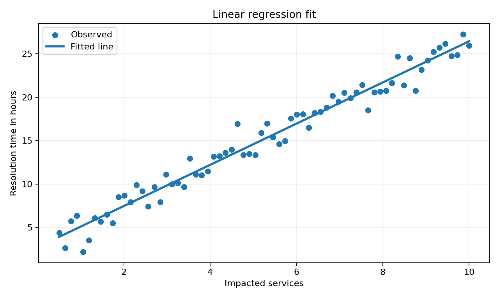
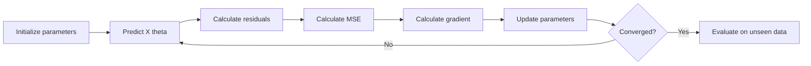
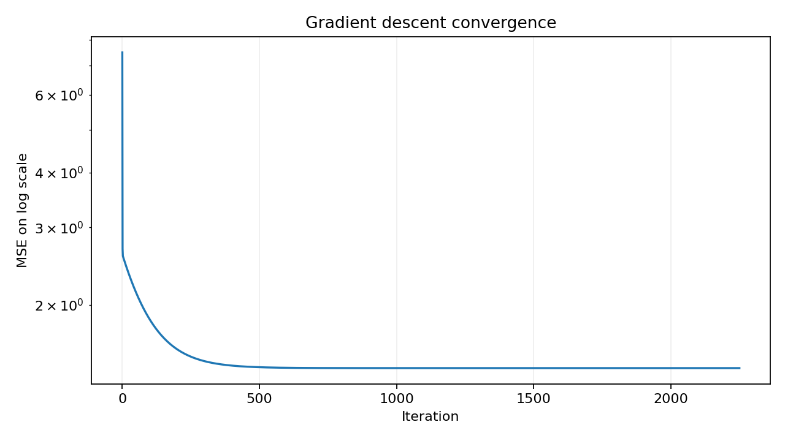
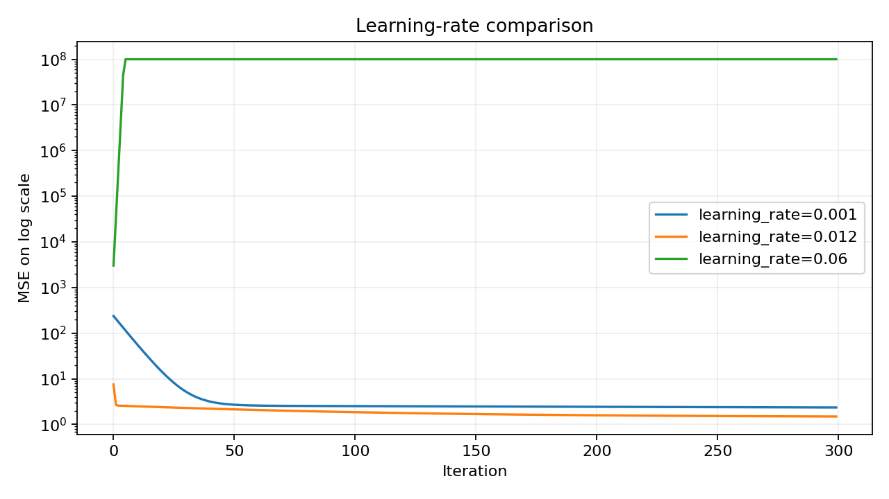
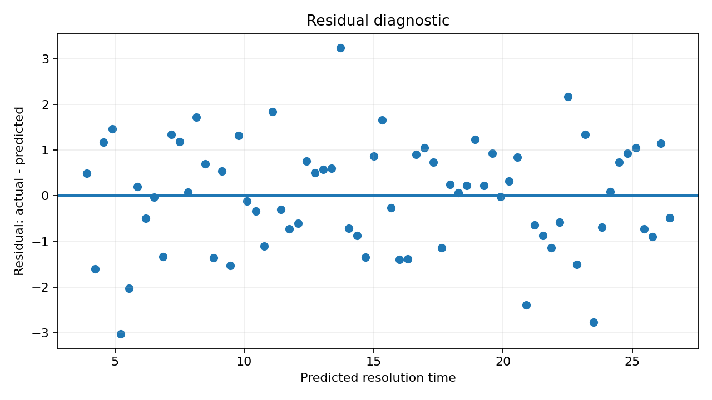

# Chapter 01 - Linear Regression, MSE, and Gradient Descent

## Learning objective

Build a linear regression model from first principles and explain how a loss function and an optimizer turn data into model parameters.

By the end of this chapter you should be able to:

- Explain slope, intercept, prediction, residual, and loss.
- Calculate MSE, RMSE, MAE, and R-squared.
- Derive the gradients of MSE.
- Implement vectorized batch gradient descent with NumPy.
- Diagnose slow convergence, divergence, and feature-scaling problems.
- Compare gradient descent with the pseudoinverse or ordinary least squares.
- Discuss when a linear baseline is preferable to a more complex model.

## Files

- [Book-style DOCX](chapter_01_linear_regression_book.docx)
- [Executed NumPy notebook](01_linear_regression_numpy.ipynb)
- [Standalone implementation](linear_regression_numpy_from_scratch.py)
- [Interview questions](interview_qa.md)
- [Exercises](exercises.md)

## 1. Problem formulation

For one feature, simple linear regression predicts:

$$
\hat{y}_i = w x_i + b
$$

where:

- $x_i$ is the feature for observation $i$.
- $w$ is the slope or feature coefficient.
- $b$ is the intercept.
- $\hat{y}_i$ is the predicted target.
- $y_i$ is the observed target.

A residual using the convention in this repository is:

$$
e_i = \hat{y}_i - y_i
$$

The sign convention is not universal. Always state it before interpreting residual direction.



## 2. Mean Squared Error

$$
J(w,b) = \frac{1}{n}\sum_{i=1}^{n}(\hat{y}_i-y_i)^2
$$

MSE is differentiable and penalizes large errors strongly. That is useful for optimization, but it also makes the metric sensitive to outliers. RMSE restores the original target unit:

$$
RMSE = \sqrt{MSE}
$$

MAE provides a more robust comparison because it uses absolute error.

## 3. Gradient derivation

Substitute $\hat{y}_i = wx_i+b$ into MSE:

$$
J(w,b) = \frac{1}{n}\sum_{i=1}^{n}(wx_i+b-y_i)^2
$$

The gradients are:

$$
\frac{\partial J}{\partial w}
= \frac{2}{n}\sum_{i=1}^{n}(\hat{y}_i-y_i)x_i
$$

$$
\frac{\partial J}{\partial b}
= \frac{2}{n}\sum_{i=1}^{n}(\hat{y}_i-y_i)
$$

The update rule is:

$$
w \leftarrow w - \alpha\frac{\partial J}{\partial w}
$$

$$
b \leftarrow b - \alpha\frac{\partial J}{\partial b}
$$

where $\alpha$ is the learning rate.

## 4. Vectorized form

For multiple features, include an intercept column in the design matrix $X$ and combine all parameters in $\theta$:

$$
\hat{y} = X\theta
$$

$$
\nabla_{\theta}J = \frac{2}{n}X^T(X\theta-y)
$$

```python
prediction = X @ theta
error = prediction - y
gradient = (2.0 / len(y)) * (X.T @ error)
theta = theta - learning_rate * gradient
```

## 5. Optimization flow





## 6. Learning-rate diagnosis

| Behavior | Likely cause | Action |
|---|---|---|
| Loss decreases very slowly | Learning rate too small or features poorly scaled | Increase carefully; standardize features |
| Loss oscillates | Learning rate too large | Reduce the learning rate |
| Loss becomes NaN or infinity | Divergence, overflow, or invalid data | Check scaling, step size, and finite values |
| Training loss falls but validation loss rises | Overfitting or distribution mismatch | Regularize, simplify, collect data, inspect split |
| Coefficients have extreme magnitudes | Collinearity, scaling, or leakage | Inspect correlations and data generation |



## 7. Closed-form solution versus gradient descent

The pseudoinverse solution is:

$$
\theta = X^{+}y
$$

Use a stable linear-algebra routine such as `np.linalg.pinv` or `np.linalg.lstsq` rather than explicitly calculating $(X^TX)^{-1}$.

| Dimension | Closed form | Gradient descent |
|---|---|---|
| Setup | Minimal | Requires learning rate and stopping policy |
| Scale | Good for modest dense problems | Better fit for large or streaming workflows |
| Debugging | Useful reference answer | Requires convergence monitoring |
| Extension | Specific to compatible objectives | General optimization pattern used across ML |



## 8. Production and leadership perspective

A Director-level answer should not end at model accuracy. Ask:

- What decision will the prediction change?
- What is the cost of underprediction and overprediction?
- Is a linear relationship plausible across all segments?
- Are features available at prediction time?
- Does the simple model improve user action compared with a rule or average?
- How will drift, residuals, latency, and adoption be monitored?
- Would a 3 percent RMSE improvement justify a harder-to-operate model?

## Mastery check

You are ready for Chapter 02 when you can derive the gradients, write the NumPy loop without notes, and explain why regression output is not automatically a probability.
