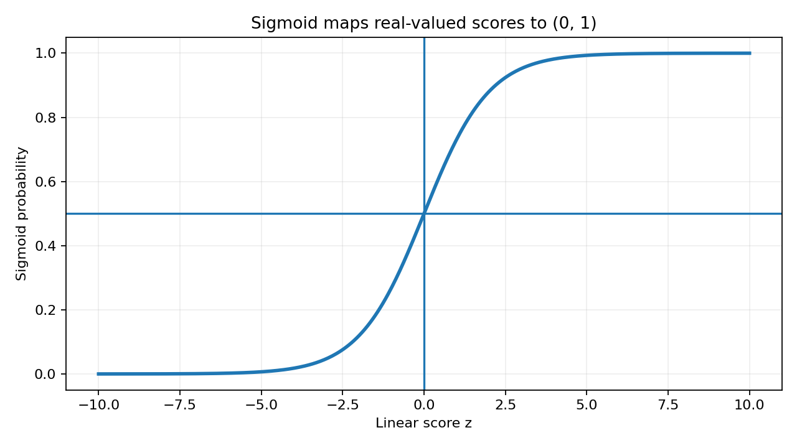
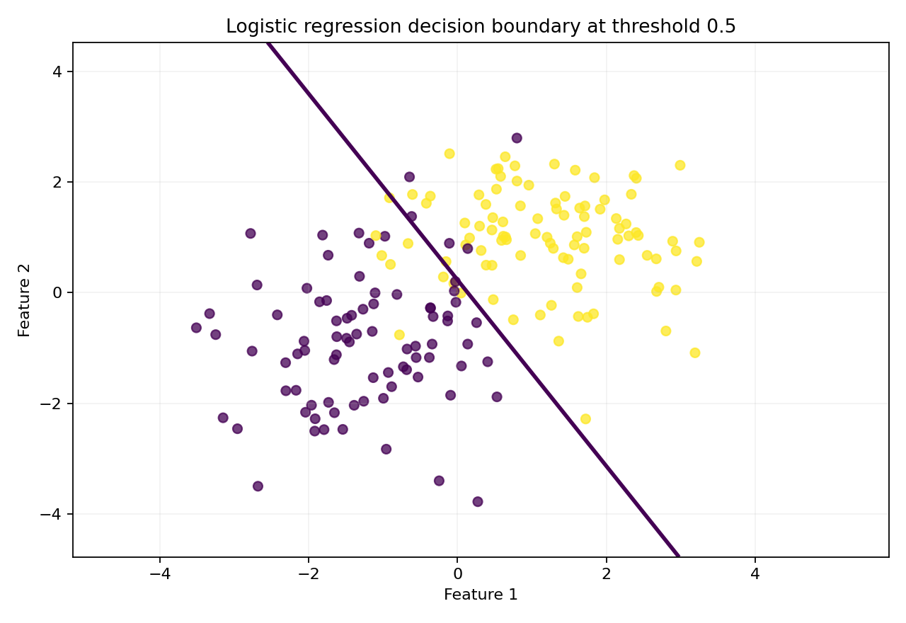

# Chapter 02 - Logistic Regression, Sigmoid, and Cross-Entropy

## Learning objective

Convert a linear score into a probability for a binary event, train the model with cross-entropy, and compare a NumPy implementation with scikit-learn.

By the end of this chapter you should be able to:

- Explain probability, odds, log-odds, logits, and the sigmoid function.
- Derive the binary cross-entropy loss and its gradient.
- Implement numerically stable logistic regression with NumPy.
- Interpret coefficients and odds ratios carefully.
- Compare from-scratch results with scikit-learn.
- Explain why the default threshold of 0.5 is not a business rule.

## Files

- [Executed notebook](02_logistic_regression_numpy_vs_sklearn.ipynb)
- [Standalone NumPy example](logistic_regression_numpy.py)
- [Interview questions](interview_qa.md)
- [Exercises](exercises.md)

## 1. From a linear score to a probability

A linear model produces a score:

$$
z_i = w^T x_i + b
$$

The score can be any real number. The sigmoid maps it to $(0,1)$:

$$
\sigma(z)=\frac{1}{1+e^{-z}}
$$

The model probability is:

$$
P(y_i=1\mid x_i)=\sigma(w^Tx_i+b)
$$

The inverse relationship is the logit:

$$
\log\left(\frac{p}{1-p}\right)=w^Tx+b
$$

This means the model is linear in log-odds, not in probability.



## 2. Why cross-entropy instead of MSE?

For binary labels $y_i\in\{0,1\}$, binary cross-entropy is:

$$
J(w,b)=-\frac{1}{n}\sum_{i=1}^{n}
\left[y_i\log(p_i)+(1-y_i)\log(1-p_i)\right]
$$

The loss heavily penalizes confident wrong predictions. It is the negative log-likelihood of a Bernoulli model and produces a convenient gradient.

For the combined parameter vector $\theta$ and design matrix $X$:

$$
p=\sigma(X\theta)
$$

$$
\nabla_{\theta}J=\frac{1}{n}X^T(p-y)
$$

The update is:

$$
\theta\leftarrow\theta-\alpha\nabla_{\theta}J
$$

## 3. Numerically stable sigmoid and loss

Directly evaluating `exp(-z)` can overflow for a large negative score. A stable implementation uses separate expressions for positive and negative values.

```python
import numpy as np


def stable_sigmoid(z):
    z = np.asarray(z, dtype=float)
    out = np.empty_like(z)
    positive = z >= 0
    out[positive] = 1.0 / (1.0 + np.exp(-z[positive]))
    exp_z = np.exp(z[~positive])
    out[~positive] = exp_z / (1.0 + exp_z)
    return out
```

For cross-entropy, clip probabilities away from exactly 0 and 1 before taking logarithms.

## 4. Training workflow


## 5. Vectorized NumPy core

```python
score = X @ theta
probability = stable_sigmoid(score)
gradient = (X.T @ (probability - y)) / len(y)
theta = theta - learning_rate * gradient
```

The intercept should normally not be regularized.

## 6. Coefficient interpretation

For feature $x_j$, a one-unit increase changes log-odds by $w_j$, holding other features constant. The odds multiplier is:

$$
\exp(w_j)
$$

Important cautions:

- A coefficient is not a causal effect without an appropriate design.
- The meaning of one unit depends on scaling.
- Correlated variables can destabilize coefficients.
- Interactions can make a single global coefficient misleading.
- The odds ratio is not the same as a probability difference.

## 7. Comparing with scikit-learn

A correct comparison must align:

- Feature scaling.
- Intercept handling.
- Regularization strength.
- Optimization tolerance.
- Train/test split.
- Label encoding.

scikit-learn logistic regression applies regularization by default. A from-scratch unregularized implementation will not necessarily match coefficients unless the configurations are made comparable.

```python
from sklearn.linear_model import LogisticRegression
from sklearn.pipeline import make_pipeline
from sklearn.preprocessing import StandardScaler

model = make_pipeline(
    StandardScaler(),
    LogisticRegression(max_iter=2000, C=1.0),
)
model.fit(X_train, y_train)
probability = model.predict_proba(X_test)[:, 1]
```

## 8. Decision boundary and threshold

The model estimates a probability. A downstream policy converts the probability into an action:

$$
\hat{y}=1 \quad \text{if} \quad p\ge t
$$

A threshold of 0.5 is only a default. For incident prioritization, missing a true P1 incident may be far more expensive than reviewing an extra alert. Threshold selection belongs in Chapter 04.



## 9. Common implementation mistakes

| Mistake | Consequence | Fix |
|---|---|---|
| Applying `log` to 0 or 1 | Infinite loss | Clip probabilities or use stable log-loss functions |
| Using labels such as 1 and 2 | Incorrect loss assumptions | Map to 0 and 1 |
| Regularizing the intercept | Unwanted bias shift | Exclude intercept from penalty |
| No feature scaling | Slow or unstable convergence | Standardize using training statistics |
| Comparing to scikit-learn without matching regularization | Coefficients differ | Align `C`, solver, scaling, and tolerance |
| Treating 0.5 as optimal | Business cost ignored | Tune threshold on validation data |

## 10. Leadership perspective

A Director-level review should ask:

- Does the system need a ranking, a probability, or an automated decision?
- How reliable are labels, especially for disputed incident priorities?
- Are model probabilities calibrated well enough for staffing or escalation decisions?
- Which segments have different base rates?
- Are features generated before or after manual triage?
- How should human overrides be captured and audited?
- What simple baseline must the model outperform?

## Mastery check

Move to Chapter 03 when you can derive $X^T(p-y)/n$, implement the optimizer without notes, and explain why good log-loss does not automatically imply good operational decisions.
