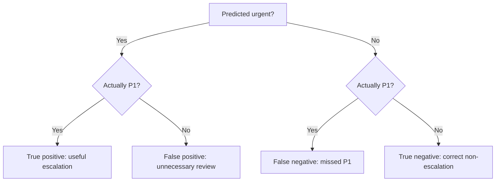
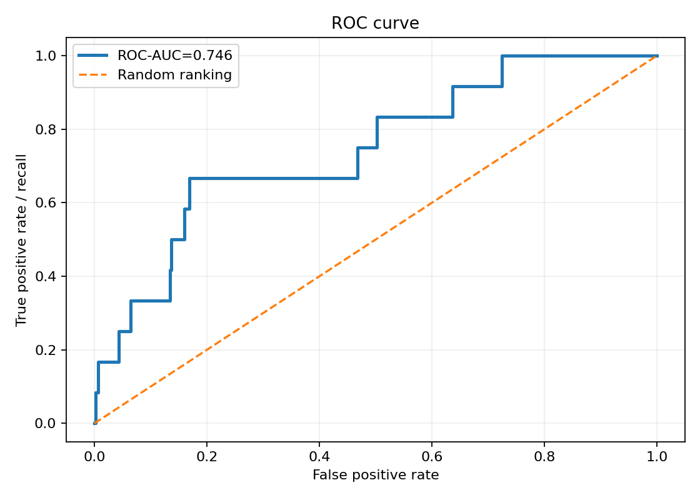
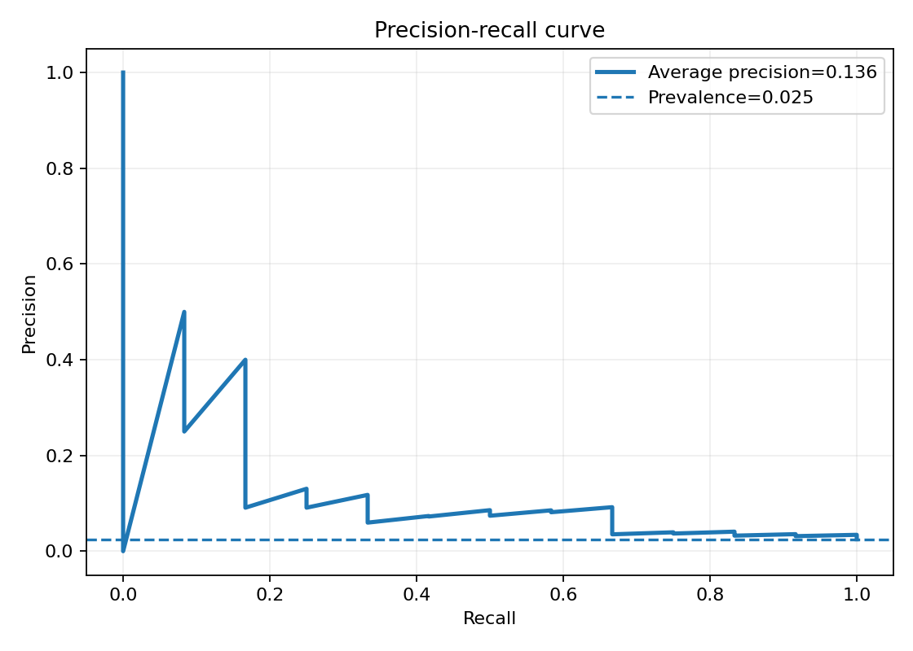

# Chapter 03 - Precision, Recall, F1, ROC-AUC, and PR-AUC

## Learning objective

Choose evaluation metrics that reflect the operational cost of incident-priority decisions, especially when P1 incidents are rare.

By the end of this chapter you should be able to:

- Build and interpret a confusion matrix.
- Calculate precision, recall, specificity, accuracy, and F1.
- Explain threshold-dependent versus threshold-independent metrics.
- Interpret ROC and precision-recall curves.
- Explain why class imbalance changes metric usefulness.
- Select a primary metric and a guardrail metric for incident prediction.

## Files

- [Executed notebook](03_classification_metrics.ipynb)
- [Interview questions](interview_qa.md)
- [Exercises](exercises.md)

## 1. Start with the decision

Assume the positive class means `is_p1 = 1`.

| Outcome | Operational interpretation |
|---|---|
| True positive | A P1 incident is escalated |
| False positive | A non-P1 incident is escalated unnecessarily |
| False negative | A P1 incident is not escalated by the model |
| True negative | A non-P1 incident is not escalated |

The confusion matrix is not merely a reporting format. It is a map from model decisions to real consequences.

## 2. Core metrics

### Accuracy

$$
Accuracy=\frac{TP+TN}{TP+TN+FP+FN}
$$

Accuracy can be misleading when the positive class is rare. A model that predicts every incident as non-P1 may appear accurate while providing no useful detection.

### Precision

$$
Precision=\frac{TP}{TP+FP}
$$

Of the incidents escalated by the model, how many were truly P1?

### Recall or sensitivity

$$
Recall=\frac{TP}{TP+FN}
$$

Of all true P1 incidents, how many did the model escalate?

### Specificity

$$
Specificity=\frac{TN}{TN+FP}
$$

Of all non-P1 incidents, how many did the model avoid escalating?

### F1 score

$$
F1=2\cdot\frac{Precision\cdot Recall}{Precision+Recall}
$$

F1 is the harmonic mean of precision and recall. It treats them symmetrically and ignores true negatives. That may or may not reflect business cost.

### F-beta

$$
F_{\beta}=(1+\beta^2)\frac{Precision\cdot Recall}{\beta^2 Precision+Recall}
$$

Use $\beta>1$ when recall deserves more weight, but explain why the chosen weight reflects a decision rather than convenience.

## 3. A worked incident example

Suppose 1,000 incidents contain 20 true P1 cases. At one threshold:

- TP = 16
- FN = 4
- FP = 64
- TN = 916

Then:

- Accuracy = 93.2 percent
- Precision = 20.0 percent
- Recall = 80.0 percent
- Specificity = 93.5 percent
- F1 = 32.0 percent

The low precision does not automatically make the model unusable. If a missed P1 is extremely costly and review capacity can absorb 80 escalations, the policy may still be valuable. The reverse can also be true.

## 4. ROC curve and ROC-AUC

The ROC curve plots:

- True positive rate, which is recall.
- False positive rate, which is $FP/(FP+TN)$.

Each point represents a different threshold. ROC-AUC can be interpreted as ranking ability: the probability that a randomly selected positive receives a higher score than a randomly selected negative, subject to standard assumptions about ties.

### ROC-AUC strengths

- Summarizes ranking across thresholds.
- Useful for comparing discrimination.
- Not tied to one class prevalence in the same direct way as precision.

### ROC-AUC limitations

- Can look strong when the negative class is very large, even if the number of false positives is operationally unacceptable.
- Does not select a threshold.
- Does not measure calibration.
- A global value can hide poor performance in important segments.

## 5. Precision-recall curve and PR-AUC

The precision-recall curve plots precision against recall as the threshold changes. It focuses on positive-class retrieval and is often more informative when positives are rare.

This repository reports average precision, a standard summary related to the area under the precision-recall curve. Always name the exact implementation because different interpolation conventions can produce slightly different values.

### PR-AUC strengths

- Focuses on performance for the positive class.
- Exposes the precision cost of increasing recall.
- The baseline is linked to positive prevalence.

### PR-AUC limitations

- Changes when class prevalence changes.
- Does not choose the operating point.
- Does not directly encode monetary or safety cost.
- Can still hide segment failures.

## 6. Metric selection for incident prediction

A reasonable scorecard for rare P1 incidents is:

| Role | Metric | Why |
|---|---|---|
| Primary discrimination | Average precision or PR-AUC | Focuses on rare positive retrieval |
| Safety guardrail | Recall at the operating threshold | Controls missed P1 incidents |
| Capacity guardrail | Precision or alerts per day | Controls review burden |
| Ranking comparison | ROC-AUC | Gives a broad discrimination view |
| Probability quality | Brier score and reliability plot | Needed if probabilities drive staffing or risk |
| Business decision | Expected cost or utility | Connects errors to operational consequences |
| Reliability | Latency, availability, data freshness | A good model that is unavailable has no value |

## 7. Threshold-dependent and threshold-independent metrics

| Category | Examples | Use |
|---|---|---|
| Threshold-dependent | Precision, recall, F1, specificity, confusion matrix | Evaluate a chosen policy |
| Ranking | ROC-AUC, average precision | Compare score ordering across thresholds |
| Probability | Log-loss, Brier score, calibration error | Evaluate probability estimates |
| Business | Expected cost, time saved, missed-impact cost | Evaluate decision value |

A strong evaluation report includes all four categories rather than searching for one universal metric.

## 8. Segment analysis

Always evaluate at least:

- Service criticality.
- Geography or business unit when appropriate and lawful.
- New versus recurring incidents.
- Time period.
- Monitoring-confidence bands.
- Incident source or product family.

The overall average can hide a severe failure for a small but high-impact group.

## 9. Data and label quality

Metric interpretation depends on trustworthy labels. Investigate:

- Was priority assigned consistently?
- Did policy definitions change over time?
- Was the label influenced by the same automation being evaluated?
- Are incidents with missing telemetry excluded systematically?
- Does delayed relabeling create stale ground truth?

## 10. Leadership perspective

A Director should require a metric contract before approving deployment:

1. Define the positive class precisely.
2. State the cost and capacity assumptions.
3. Choose primary and guardrail metrics.
4. Define evaluation segments.
5. Define minimum acceptable performance and confidence intervals.
6. Define who may change the threshold.
7. Define monitoring and rollback criteria.

## Mastery check

Move to Chapter 04 when you can calculate the metrics from raw counts and defend why an incident model might prioritize recall while still controlling precision and alert volume.
