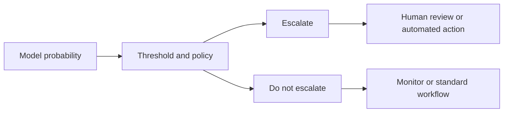

# Chapter 04 - Threshold Selection and Probability Calibration

## Learning objective

Turn model probabilities into operational actions using explicit costs, constraints, and calibration evidence.

By the end of this chapter you should be able to:

- Explain why 0.5 is not a universal threshold.
- Tune a threshold using validation data only.
- Create precision, recall, alert-volume, and cost curves across thresholds.
- Explain discrimination versus calibration.
- Create and interpret a reliability diagram.
- Calculate Brier score and expected calibration error.
- Compare sigmoid and isotonic calibration at a conceptual level.

## Files

- [Executed notebook](04_thresholds_and_calibration.ipynb)
- [Interview questions](interview_qa.md)
- [Exercises](exercises.md)

## 1. Probability is not an action

A model may output $P(y=1\mid x)=0.23$. An operational policy still must decide whether to escalate, defer, request more evidence, or send the case to a human.

For a binary threshold $t$:

$$
\hat{y}=\begin{cases}
1 & p\ge t\\
0 & p<t
\end{cases}
$$

Changing $t$ changes the confusion matrix, precision, recall, workload, and expected cost.

## 2. Cost-based threshold selection

Suppose:

- A false positive costs 1 review unit.
- A false negative costs 25 risk units.

For a threshold $t$:

$$
Cost(t)=C_{FP}\cdot FP(t)+C_{FN}\cdot FN(t)
$$

Choose the threshold that minimizes validation cost subject to guardrails such as:

- Recall must be at least 90 percent.
- Alerts must not exceed team capacity.
- Precision must remain above a trust threshold.
- Critical-service recall must exceed a separate target.

A single cost number is rarely sufficient. Use constraints and sensitivity analysis because cost estimates are uncertain.

## 3. Validation protocol

Use three partitions:

1. Train: fit preprocessing and model parameters.
2. Validation: select hyperparameters, calibration method, and threshold.
3. Test: evaluate the frozen pipeline and threshold once.

Do not repeatedly adjust the threshold after inspecting test performance. That turns the test set into another validation set.

For time-dependent incidents, prefer temporal splits that simulate future deployment.

## 4. Discrimination versus calibration

Discrimination asks whether positives tend to receive higher scores than negatives. ROC-AUC and average precision evaluate this property.

Calibration asks whether predicted probabilities match observed frequencies. If the model assigns 0.30 to many comparable incidents, approximately 30 percent should be positive over time for a well-calibrated model.

A model can rank cases well but produce unreliable probabilities. It can also be reasonably calibrated but insufficiently discriminative.

## 5. Reliability diagram

A reliability diagram groups probabilities into bins. For each bin it compares:

- Mean predicted probability.
- Observed positive fraction.

Perfect calibration lies near the diagonal.

Interpretation:

- Curve below diagonal: the model is overconfident; predicted probabilities are too high.
- Curve above diagonal: the model is underconfident; predicted probabilities are too low.
- Sparse bins: conclusions are uncertain; show counts or histograms.

## 6. Brier score

For binary outcomes:

$$
Brier=\frac{1}{n}\sum_{i=1}^{n}(p_i-y_i)^2
$$

Lower is better. Brier score combines calibration and discrimination, so use it alongside a reliability plot rather than as a complete diagnosis.

## 7. Expected calibration error

A common binned approximation is:

$$
ECE=\sum_{k=1}^{K}\frac{|B_k|}{n}
\left|accuracy(B_k)-confidence(B_k)\right|
$$

ECE depends on binning and can hide local errors. Report the binning strategy and inspect the diagram.

## 8. Calibration methods

### Sigmoid or Platt-style calibration

Fits a logistic mapping from model score to probability. It is relatively data-efficient and constrained to a smooth S-shaped mapping.

### Isotonic calibration

Fits a monotonic stepwise mapping. It is more flexible but can overfit when calibration data is limited.

### Important rule

The calibrator must be trained on data that was not used to fit the base model predictions being calibrated. Cross-validation calibration is one method for obtaining unbiased calibration predictions.

## 9. Threshold policies beyond one global number

Consider:

- A high-confidence auto-escalation threshold.
- A middle human-review band.
- A low-confidence standard workflow.
- Different thresholds for service criticality, only when justified, governed, and monitored.
- Capacity-aware queues that rank cases instead of making independent binary decisions.

Avoid ad hoc segment thresholds that create unfair or unstable behavior.

## 10. Production monitoring

Monitor:

- Active threshold and change history.
- Prediction and score distribution.
- Alert volume and queue age.
- Precision and recall after labels arrive.
- Brier score and reliability diagrams over time.
- Segment-level calibration.
- Data freshness and missingness.
- Override rate and reason.
- Threshold-policy incidents and rollback readiness.

## 11. Leadership perspective

Threshold changes are product and risk decisions. Establish:

- Named owner and approval process.
- Cost assumptions and review capacity.
- Offline acceptance tests.
- Shadow or canary rollout.
- Human-override mechanism.
- Audit log.
- Rollback triggers.
- Periodic recalibration and threshold review.

## Mastery check

Move to Chapter 05 when you can select a threshold on validation data, defend the cost assumptions, and explain why a high ROC-AUC model may still require calibration.
