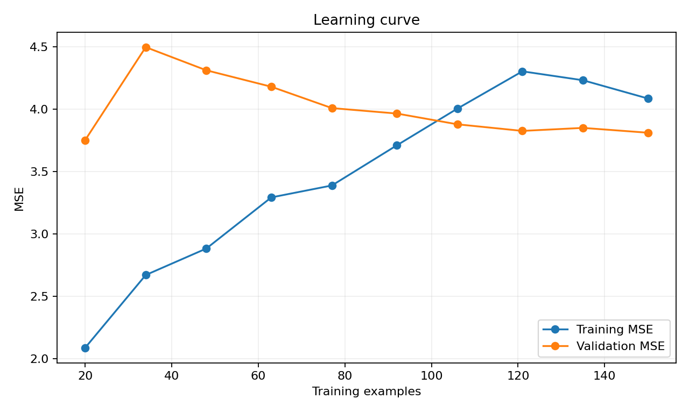
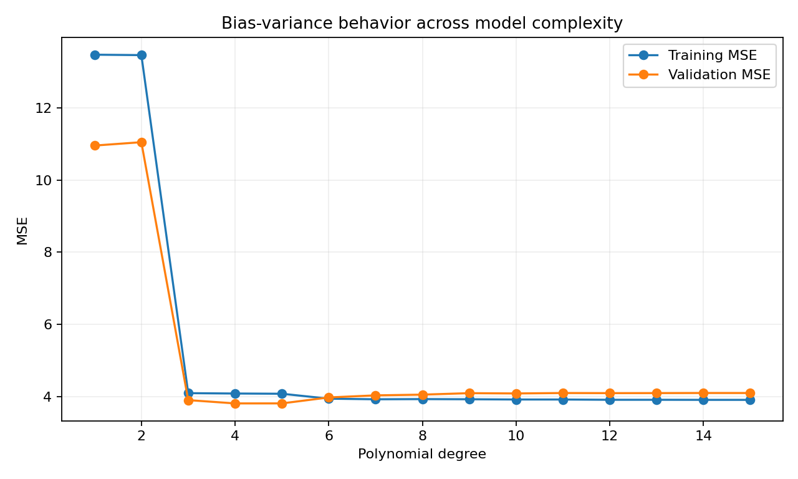
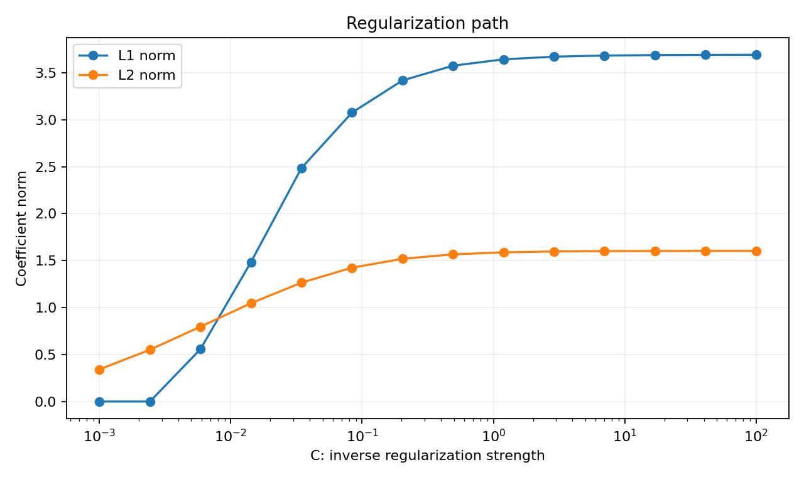

# Chapter 05 - Bias, Variance, L1/L2 Regularization, and Learning Curves

## Learning objective

Diagnose generalization problems and apply regularization and learning curves before increasing model complexity.

By the end of this chapter you should be able to:

- Explain underfitting, overfitting, bias, variance, and irreducible noise.
- Diagnose high bias and high variance from training and validation behavior.
- Explain L1 and L2 penalties mathematically and operationally.
- Interpret regularization strength in NumPy and scikit-learn conventions.
- Build and interpret learning curves.
- Separate overfitting from data leakage and distribution shift.

## Files

- [Executed notebook](05_bias_variance_regularization.ipynb)
- [Interview questions](interview_qa.md)
- [Exercises](exercises.md)

## 1. Generalization is the objective

Training performance measures fit to known examples. The real objective is performance on future, representative data.

A useful conceptual decomposition is:

$$
Expected\ Error \approx Bias^2 + Variance + Irreducible\ Noise
$$

This equation is exact only under particular assumptions, but it is a useful diagnostic framework.

- High bias: the model or features are too limited to capture the pattern.
- High variance: the model fits training-specific noise or unstable details.
- Irreducible noise: uncertainty remains even with the best available model.

## 2. Underfitting and overfitting

| Pattern | Training error | Validation error | Likely diagnosis |
|---|---|---|---|
| Both high and close | High | High | High bias or weak features |
| Training low, validation much higher | Low | High | High variance, leakage, or shift |
| Both low and close | Low | Low | Good fit for the evaluation distribution |
| Validation unexpectedly better | Higher | Lower | Sampling noise, regularization behavior, or split differences |

Do not label every train-validation gap as overfitting. First inspect leakage, duplicate records, temporal mismatch, and inconsistent preprocessing.

## 3. Learning curves

A learning curve plots training and validation performance against training-set size.



Interpretation:

### High bias pattern

- Training and validation errors converge at a high value.
- More data alone may not help much.
- Improve features, interactions, model class, or label quality.

### High variance pattern

- Training error is low.
- Validation error is substantially higher.
- More representative data, stronger regularization, simpler models, or better cross-validation may help.

Learning curves should preserve temporal or group structure where required. Random subsets can produce optimistic conclusions for dependent data.

## 4. L2 regularization

For logistic regression with weights $w$:

$$
J_{L2}=J_{data}+\frac{\lambda}{2}\sum_j w_j^2
$$

The gradient adds:

$$
\lambda w_j
$$

L2 shrinks coefficients smoothly toward zero. It often improves stability when features are correlated and reduces sensitivity to noise.

## 5. L1 regularization

$$
J_{L1}=J_{data}+\lambda\sum_j |w_j|
$$

L1 can set some coefficients exactly to zero, creating a sparse model. It can support feature selection, but correlated features may be selected unstably.

## 6. L1 versus L2

| Dimension | L1 | L2 |
|---|---|---|
| Penalty | Absolute magnitude | Squared magnitude |
| Coefficients | Can become exactly zero | Usually shrink but remain nonzero |
| Correlated features | May choose one inconsistently | Often shares weight more smoothly |
| Optimization | Nondifferentiable at zero; use subgradient or specialized solver | Smooth gradient |
| Use case | Sparse model or feature selection | Stability and generalization |

Elastic Net combines both.

## 7. Regularization strength conventions

This repository uses $\lambda$ as penalty strength: larger $\lambda$ means stronger regularization.

scikit-learn logistic regression commonly uses `C`, which is inverse regularization strength: smaller `C` means stronger regularization.

Never compare a NumPy `lambda` directly with scikit-learn `C` without aligning the exact objective and scaling convention.

## 8. Feature scaling and regularization

If one feature ranges from 0 to 1 and another from 0 to 1,000, an equal coefficient penalty does not represent an equal effect. Standardize continuous features using training statistics before regularized linear models.

Use a pipeline so scaling and model fitting are repeated correctly inside cross-validation:

```python
from sklearn.linear_model import LogisticRegression
from sklearn.pipeline import make_pipeline
from sklearn.preprocessing import StandardScaler

model = make_pipeline(
    StandardScaler(),
    LogisticRegression(C=0.1, penalty="l2", max_iter=2000),
)
```

## 9. Polynomial complexity demonstration

A linear model may underfit a curved relationship. Adding polynomial features can reduce bias, but high degree can increase variance.



The correct degree is selected using validation or cross-validation, not training error.

## 10. Regularization path

A regularization path shows how coefficient magnitude changes as penalty strength changes.



Look for:

- Coefficients that remain stable across a useful range.
- Coefficients that change sign or magnitude sharply.
- Validation performance plateaus.
- Sparse solutions that remove weak or redundant features.

Do not treat coefficient stability as proof of causality.

## 11. Data-centric alternatives

Before increasing complexity, consider:

- Clarify the label definition.
- Remove duplicated or post-outcome features.
- Improve missing-value handling.
- Collect underrepresented segments.
- Add domain-informed interactions.
- Repair telemetry quality.
- Shorten label delay.
- Use a temporal evaluation design.

## 12. Leadership perspective

A Director-level model review should ask:

1. Is the gap real, or caused by leakage or split design?
2. Is the model data-limited, feature-limited, or capacity-limited?
3. Does added complexity improve a business decision, not merely a metric?
4. Can the team operate, explain, and monitor the more complex model?
5. Is the regularization choice reproducible and governed?
6. Which segments remain high-error after the average improves?

## Mastery check

Move to the capstone when you can diagnose learning curves, explain L1 versus L2, and design a leakage-safe cross-validation and regularization workflow.
