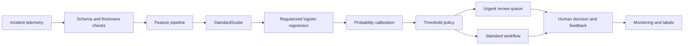

# Chapter 06 - End-to-End Incident-Priority Classifier

## Project objective

Build a transparent, reproducible classifier that ranks newly created incidents by the probability that they will become P1 incidents. Use only information available near incident creation, tune the operating threshold on validation data, evaluate once on a future test period, and produce a safe rollout recommendation.

This is a teaching project using synthetic data. It demonstrates process, not production readiness.

## Files

- [Executed capstone notebook](06_incident_priority_classifier.ipynb)
- [Synthetic dataset](../../data/incident_priority_synthetic.csv)
- [Data dictionary](../../data/DATA_DICTIONARY.md)
- [Model card](MODEL_CARD.md)
- [Architecture and rollout plan](SYSTEM_DESIGN.md)
- [Interview questions](interview_qa.md)
- [Five-minute project explanation](project_explanation.md)

## 1. Business problem

P1 incidents are rare but high-impact. Manual triage may be delayed when many incidents arrive at once. The proposed model does not replace incident commanders. It ranks and flags incidents for faster human review.

### Proposed user

- On-call operations lead.
- Incident-management team.
- Service owner.

### Proposed action

- High score: urgent review queue.
- Middle score: standard review with additional evidence requested.
- Low score: normal workflow, with continued monitoring.

### Non-goal

The first release must not automatically execute remediation or close incidents.

## 2. Success criteria

### Model criteria

- Improve average precision over prevalence and a simple rule baseline.
- Achieve the validation recall guardrail selected by operations.
- Keep expected alert volume within capacity.
- Produce probabilities with acceptable calibration for queue planning.
- Avoid major performance collapse for critical-service segments.

### Business criteria

- Reduce time from incident creation to qualified review.
- Reduce missed P1 escalations.
- Avoid unmanageable alert burden.
- Preserve human override and auditability.

### System criteria

- Predictions available within the required latency.
- Input data freshness and schema checks.
- Full decision logging.
- Fallback to standard workflow if the model or data is unavailable.

## 3. Dataset

The synthetic dataset contains 2,400 time-ordered incidents. The positive class is intentionally rare.

Features:

- Service criticality.
- Estimated customer impact.
- Number of affected services.
- Error rate.
- Latency increase.
- Recent deployment indicator.
- Repeat-incident indicator.
- Monitoring confidence.

Target:

- `is_p1`, which is known after triage and must never be used as an input.

## 4. Leakage review

For every candidate feature ask:

1. Was it created before the decision time?
2. Does it contain the target directly or indirectly?
3. Was it produced by the same manual process the model is meant to assist?
4. Will the production value have the same definition and latency?
5. Could retries, updates, or backfills expose future information?

Examples of leaked fields would include final priority, final resolver group, time to resolution, post-incident impact, or a status set after escalation.

## 5. Temporal split

The project uses:

- First 60 percent: training.
- Next 20 percent: validation.
- Final 20 percent: test.

Training data fits preprocessing and model parameters. Validation data selects hyperparameters, calibration, and threshold. Test data estimates future performance once the policy is frozen.

## 6. Baselines

A responsible project starts with simple comparisons:

1. Predict no incidents as P1.
2. Escalate only service-criticality 5 incidents.
3. Rank by a manually defined risk score.
4. Regularized logistic regression.

The ML model must improve a decision outcome, not merely outperform an intentionally weak baseline.

## 7. Modeling pipeline

The notebook uses a scikit-learn pipeline to prevent preprocessing leakage. Logistic regression is chosen as the first production candidate because it is fast, explainable, and produces a strong probability baseline.

## 8. Class imbalance

P1 incidents are approximately 2 percent of the synthetic sample. The project therefore emphasizes:

- Average precision.
- Recall at the active threshold.
- Precision and alert volume.
- Expected cost.
- Calibration.
- Segment behavior.

Accuracy is reported only as secondary context.

## 9. Threshold policy

The validation threshold is selected by minimizing:

$$
Cost(t)=1\cdot FP(t)+25\cdot FN(t)
$$

subject to a recall guardrail. The values are illustrative. A production cost model must be created with operations, finance, risk, and service owners.

The threshold is locked before test evaluation.

## 10. Calibration

The notebook compares raw and calibrated probabilities using:

- Brier score.
- Reliability diagram.
- Expected calibration error.

Calibration is particularly important when probabilities drive staffing forecasts or different levels of intervention.

## 11. Evaluation report

The notebook reports:

- Positive prevalence.
- ROC-AUC.
- Average precision.
- Log-loss.
- Brier score.
- Confusion matrix.
- Precision, recall, specificity, and F1.
- Expected cost.
- Alert count and alert rate.
- Segment performance by service criticality.
- Calibration plot.

## 12. Error analysis

Review false negatives first because they represent missed P1 incidents. For each error, inspect:

- Telemetry availability at decision time.
- Whether the label is disputed.
- New failure modes.
- Low monitoring confidence.
- Segment or service-specific patterns.
- Whether the threshold rather than ranking caused the miss.

False positives should be grouped by cause to reduce review burden without sacrificing recall.

## 13. Rollout plan

### Phase 1 - Offline validation

- Reproduce metrics and data lineage.
- Conduct label and leakage review.
- Obtain incident-management sign-off on costs and guardrails.

### Phase 2 - Shadow mode

- Score live incidents without changing workflow.
- Compare model recommendations with actual triage.
- Measure latency, data freshness, calibration, and queue impact.

### Phase 3 - Human-in-the-loop pilot

- Show scores and explanations to a limited operations group.
- Require human confirmation.
- Capture override reasons.

### Phase 4 - Controlled expansion

- Expand services gradually.
- Use canary deployment and rollback.
- Review weekly error and segment reports.

### Phase 5 - Mature operation

- Formal change process for model, features, calibration, and threshold.
- Continuous monitoring and periodic retraining.
- Incident response for model or data failures.

## 14. Monitoring contract

| Layer | Signals |
|---|---|
| Data | Missingness, schema, range, freshness, drift |
| Model | Score distribution, AUC/AP when labels arrive, calibration, segment metrics |
| Policy | Threshold, alert rate, queue age, override rate, false-negative review |
| System | Latency, availability, errors, fallback rate |
| Business | Time to qualified review, missed P1s, workload, user adoption |

## 15. Director-level decision

A credible recommendation is conditional:

> Approve a shadow-mode pilot, not autonomous action. The model must demonstrate stable recall, manageable alert volume, acceptable calibration, and no severe segment failures on live representative data. Human decision authority, audit logs, fallback, and rollback are mandatory for the initial release.

## Completion criteria

The capstone is complete when all tests and notebooks run, the threshold is selected only on validation data, the test set is evaluated once, and the model card states limitations rather than presenting synthetic performance as production evidence.
