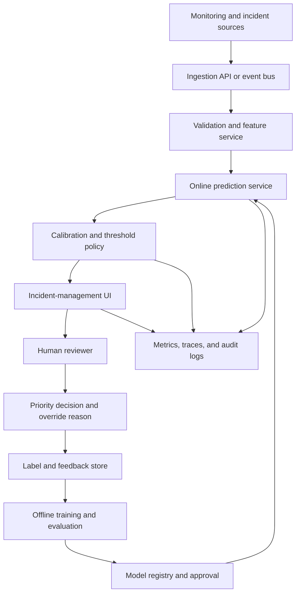

# System Design and Rollout

## Logical architecture

## Key design decisions

### Synchronous or asynchronous

A score needed during ticket creation may require synchronous serving. A secondary enrichment model can be asynchronous. The workflow should degrade safely when the model is unavailable.

### Feature availability

Use only features available at or before the decision timestamp. Record event time and processing time to detect backfill and lateness.

### Model service

Package preprocessing and model together. Version model, feature schema, calibration mapping, and threshold policy independently but release them as one approved decision bundle.

### Security

Use least privilege, service identity, encryption, secret management, audit logging, and strict access to incident details. Explanations must not reveal sensitive information to unauthorized users.

### Reliability

Define latency and availability SLOs. Use timeouts, circuit breakers, cached defaults where safe, and a standard-workflow fallback.

### Observability

Trace input version, feature values, model version, raw score, calibrated probability, threshold, decision, user override, and final label.

## Failure modes

| Failure | Safe response |
|---|---|
| Missing critical features | Do not auto-escalate based only on the model; route for standard review |
| Prediction service unavailable | Use normal incident process and alert platform owner |
| Score distribution shift | Trigger investigation and consider disabling the model |
| Alert volume exceeds capacity | Activate approved capacity policy; do not silently raise threshold |
| Calibration degrades | Recalibrate or revert after validation |
| Label definition changes | Suspend metric comparisons and retrain under approved definition |

## Change governance

Any change to features, model, calibration, threshold, or target definition must include:

- Versioned proposal.
- Offline evaluation.
- Segment and safety review.
- Capacity impact.
- Approval owner.
- Canary or shadow plan.
- Rollback criterion.
